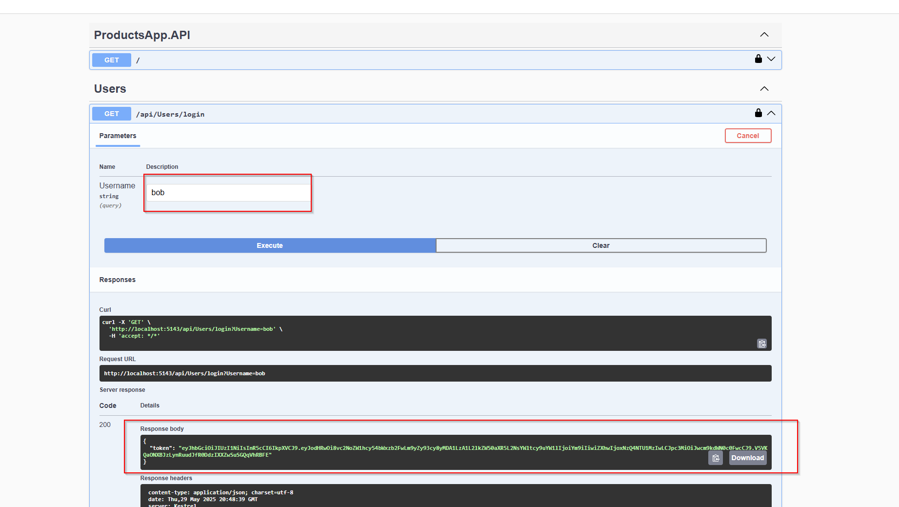
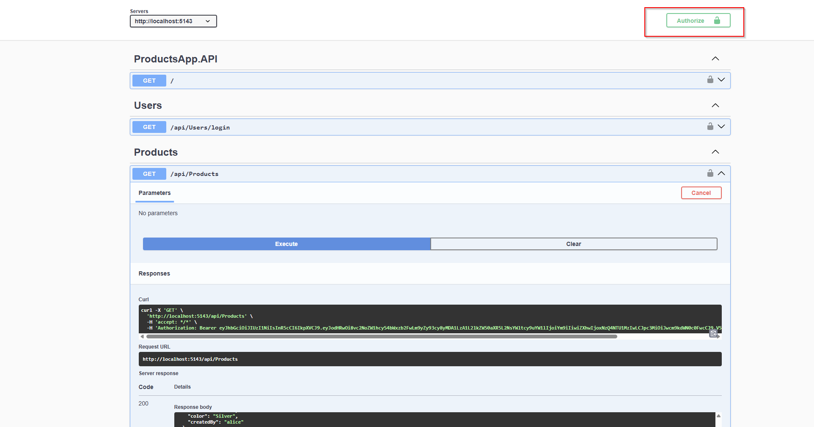

# ProductsApp API

An application that demonstrated:

- User login with JWT token issuance
- product querying via dynamic filters
- Health check endpoint
- EF Core + SQLite + JWT authentication
- XUnit tests
---

## How To Test

## Authentication approaches

1. Use one of the pre-seeded usernames to obtain a valid JWT:

- `alice`
- `bob`
- `charlie`

2. Register a new user using the api/Users/register endpoint

After obtaining a JWT please click on the authorize button
and paste the token inside the dialog (Do not prefix with Bearer!)

## Products

After the tokens are set you will have access to the products endpoints.

1. The api/products GET endpoint returns all products existing in the database.
2. The api/products/query GET endpoint returns by the criteria specified in the query params
3. The api/products/{id} GET endpoint returns a product by id or returns a not found response
4. The api/products POST endpoint creates a product (created by will be automatically assigned to the user the JWT is issued for)
5. The api/products/{id} PUT endpoint updates a product by id (only if the user is the one who created the product)
6. The api/products/{id} DELETE endpoint deletes a product by id (only if the user is the one who created the product)

## Ecommerce system diagram

###	 1. Browsing Products
The user visits the website, A GET /products request is sent to the API Gateway, which forwards the request to the Products Service.
The Products Service queries the Producs Database and returns the product list.

### 2. Adding To Cart
When the user adds a product to their cart, an Add to Cart request is sent to the API Gateway, which routes it to the Products Service.
The Products Service updates the distributed cache (Redis for example) to reflect the current state of the user's cart.

### 3. Checkout Flow
When the user clicks Checkout, a Create Order request is sent to the API Gateway, which forwards it to the Orders Service.
A new order is created with status Pending in the Orders Database.
The API Gateway then synchronously calls the Payments Service, which:
1. Initiates a payment request to payment provider
2. Saves Pending payment record in Payment Database
3. Returns the payment link to the frontend for a secure IFrame checkout

### 4 Payment Completion
Once the user completes the payment, a Payment Completed callback is received via the API Gateway and forwarded to the Payments Service, which:
1. Updates the payment status to Completed in the Payments DB.
2. Publishes a Change Order Status Event to the Service Bus.

The Orders Service consumes this event, updates the order status accordingly and may notify other services, for example:

1. Shipping Service
2. Inventory Service
3. Notification Service (for email confirmations)